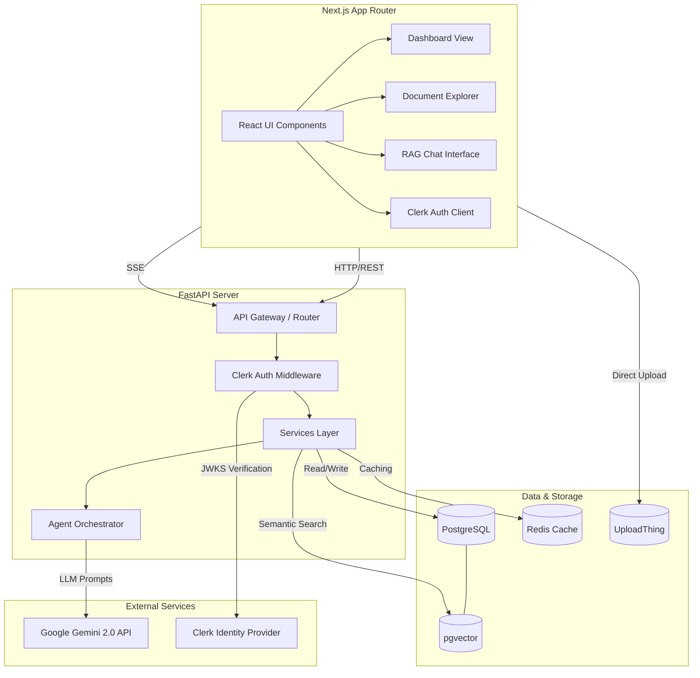
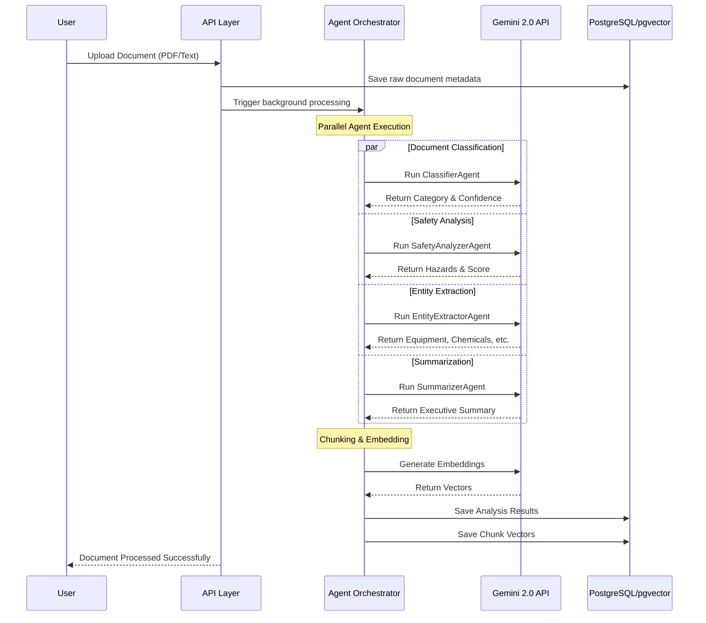
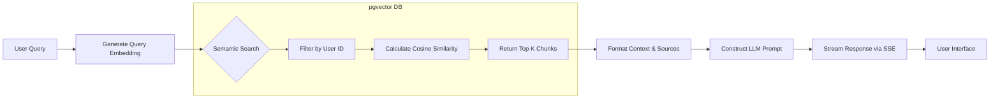

# MiningNiti Architecture

MiningNiti is a production-grade Document Intelligence and RAG Chat platform tailored for the Mining Industry. It utilizes an Agentic AI workflow to extract structured data, classify documents, identify safety hazards, and provide intelligent chat over a corpus of documents.

## High-Level System Architecture

## AI Agent Workflow (Document Processing)

The core value of MiningNiti lies in its document processing pipeline. When a document is uploaded, it is passed to an Orchestrator that triggers a series of specialized AI agents.

## AI Chat Workflow (Retrieval-Augmented Generation)

The Chat Interface provides an intelligent, context-aware conversational agent that cites its sources.

## Security & Access Control

- **Authentication**: Managed entirely by Clerk via JSON Web Tokens (JWT).
- **Backend Verification**: FastAPI extracts the JWT from the `Authorization: Bearer` header and verifies it cryptographically against Clerk's JSON Web Key Set (JWKS).
- **Data Isolation**: Every database query (Documents, Chat Sessions, Analytics) filters by `user_id`. No user can ever read data belonging to another user.

## Deployment Topology

- **Frontend**: Deployed on Vercel Edge Network.
- **Backend**: Deployed as a Docker container on Render / Railway.
- **Database**: PostgreSQL 16+ instance with `pgvector` extension hosted on Neon / Supabase.
