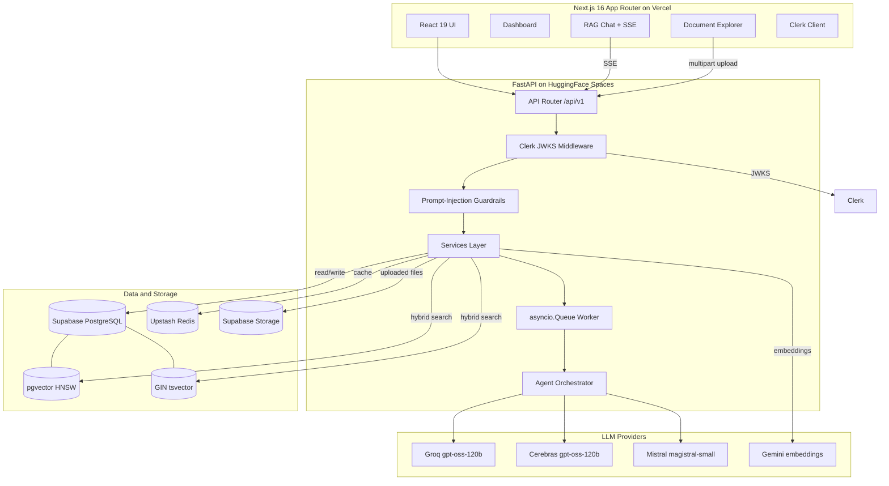
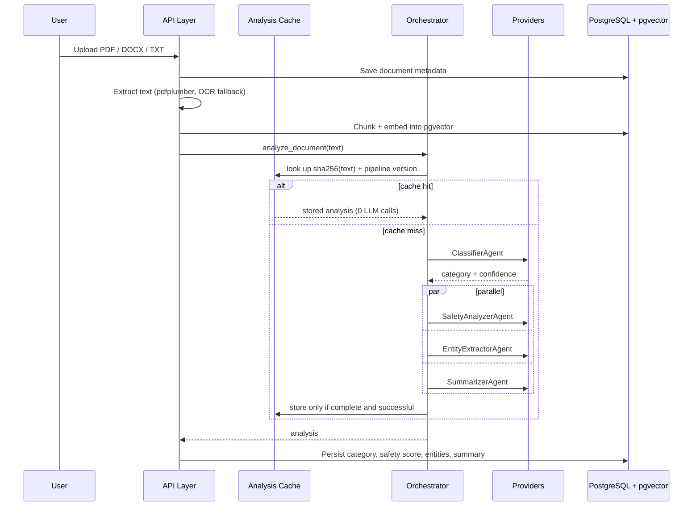
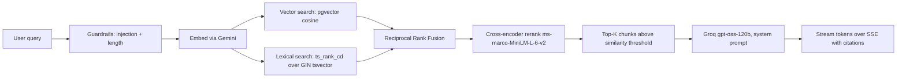

# MiningNiti Architecture

MiningNiti is a document intelligence and RAG chat platform for the mining
industry. Uploaded documents are classified, screened for hazards, mined for
entities and summarised by a group of specialised agents; the resulting chunks
are embedded into pgvector and served back through a hybrid-retrieval chat that
cites the document and page behind every claim.

## High-Level System Architecture

```mermaid
graph TD
    subgraph Frontend [Next.js 16 App Router on Vercel]
        UI[React 19 UI]
        Dash[Dashboard]
        Doc[Document Explorer]
        Chat[RAG Chat + SSE]
        Auth1[Clerk Client]
    end

    subgraph Backend [FastAPI on HuggingFace Spaces]
        API[API Router /api/v1]
        Auth2[Clerk JWKS Middleware]
        Guard[Prompt-Injection Guardrails]
        Serv[Services Layer]
        Queue[asyncio.Queue Worker]
        Agent[Agent Orchestrator]
    end

    subgraph Data [Data and Storage]
        PG[(Supabase PostgreSQL)]
        Vect[(pgvector HNSW)]
        FTS[(GIN tsvector)]
        Redis[(Upstash Redis)]
        Blob[(Supabase Storage)]
        PG --- Vect
        PG --- FTS
    end

    subgraph External [LLM Providers]
        Groq[Groq gpt-oss-120b]
        Cerebras[Cerebras gpt-oss-120b]
        Mistral[Mistral magistral-small]
        Gemini[Gemini embeddings]
    end

    UI --> API
    Chat -- SSE --> API
    Doc -- multipart upload --> API

    API --> Auth2 --> Guard --> Serv
    Serv --> Queue --> Agent
    Serv -- read/write --> PG
    Serv -- hybrid search --> Vect
    Serv -- hybrid search --> FTS
    Serv -- cache --> Redis
    Serv -- uploaded files --> Blob

    Agent --> Groq
    Agent --> Cerebras
    Agent --> Mistral
    Serv -- embeddings --> Gemini
    Auth2 -- JWKS --> Clerk[Clerk]
```

## Agents

Five agents exist. Four run on every upload; the fifth runs only when a
compliance audit is created.

| Agent | Provider / model | When it runs |
|---|---|---|
| Classifier | Groq `openai/gpt-oss-120b` | Upload, first — its category feeds the others |
| Safety Analyzer | Mistral `magistral-small-latest` | Upload, in parallel (skipped for non-safety categories) |
| Entity Extractor | Cerebras `gpt-oss-120b` | Upload, in parallel |
| Summarizer | Cerebras `gpt-oss-120b` | Upload, in parallel |
| Compliance Auditor | Groq `openai/gpt-oss-120b` | On demand, from `compliance_service.py` |

Retry and provider fallback live in `BaseAgent._generate_json` only. The
classifier and compliance auditor fall back to Cerebras when Groq rate-limits,
because Groq's free tier (8K tokens/minute) is the tightest budget in the system
and Cerebras serves the identical model at 30K/minute.

## Document Processing

```mermaid
sequenceDiagram
    participant User
    participant API as API Layer
    participant Cache as Analysis Cache
    participant Orch as Orchestrator
    participant LLM as Providers
    participant DB as PostgreSQL + pgvector

    User->>API: Upload PDF / DOCX / TXT
    API->>DB: Save document metadata
    API->>API: Extract text (pdfplumber, OCR fallback)
    API->>DB: Chunk + embed into pgvector

    API->>Orch: analyze_document(text)
    Orch->>Cache: look up sha256(text) + pipeline version
    alt cache hit
        Cache-->>Orch: stored analysis (0 LLM calls)
    else cache miss
        Orch->>LLM: ClassifierAgent
        LLM-->>Orch: category + confidence
        par parallel
            Orch->>LLM: SafetyAnalyzerAgent
        and
            Orch->>LLM: EntityExtractorAgent
        and
            Orch->>LLM: SummarizerAgent
        end
        Orch->>Cache: store only if complete and successful
    end

    Orch-->>API: analysis
    API->>DB: Persist category, safety score, entities, summary
```

A failed or partial analysis is never cached, so re-analysing a document that
hit a rate limit genuinely re-runs the agents.

## RAG Chat

```mermaid
flowchart LR
    A[User query] --> G[Guardrails: injection + length]
    G --> B[Embed via Gemini]
    B --> C[Vector search: pgvector cosine]
    B --> D[Lexical search: ts_rank_cd over GIN tsvector]
    C --> E[Reciprocal Rank Fusion]
    D --> E
    E --> F[Cross-encoder rerank ms-marco-MiniLM-L-6-v2]
    F --> H[Top-K chunks above similarity threshold]
    H --> I[Groq gpt-oss-120b, system prompt]
    I --> J[Stream tokens over SSE with citations]
```

The lexical arm is PostgreSQL full-text search, not BM25 and no longer
`pg_trgm` — trigram similarity scored short questions too low to be useful. See
the history note at the top of `app/services/hybrid_search.py`.

## Retrieval Quality Gate

Retrieval is scored against a labelled golden set of 12 queries over a
130-chunk corpus, and runs in CI as a blocking gate using a local
sentence-transformers model so it needs no API keys.

| Metric | Floor | Current |
|---|---|---|
| Hit Rate@5 | 0.90 | 1.000 |
| MRR | 0.75 | 1.000 |
| Recall@5 | 0.85 | 0.958 |
| nDCG@5 | 0.75 | 0.968 |

Generation quality (faithfulness, relevancy) is judged by Gemini and run on
demand rather than in CI, because it needs an API key.

## Security and Access Control

- **Authentication**: Clerk JWTs, verified server-side against Clerk's JWKS.
- **Data isolation**: every document, chat and analytics query filters by
  `user_id` taken from the JWT `sub` claim.
- **Guardrails**: queries over 1500 characters or matching any of ~20 prompt
  injection patterns are rejected before reaching retrieval.
- **Rate limiting**: 120 requests/minute per IP via slowapi.

## Deployment

- **Frontend**: Vercel.
- **Backend**: Docker image on HuggingFace Spaces, deployed by
  `.github/workflows/deploy.yml` on pushes to `main` touching `backend/**`.
  Alembic migrations run at container start, before the server binds.
- **Database**: Supabase PostgreSQL with `pgvector` and `pg_trgm`.
- **Cache**: Upstash Redis (optional — everything degrades to a no-op without it).
- **Uploads**: Supabase Storage. Without `SUPABASE_URL` configured, uploaded
  files are lost on every container restart.

Total infrastructure cost: $0/month, all free tiers.

## Known Limits

- Database access is synchronous SQLAlchemy inside async endpoints, so
  throughput per worker is bounded.
- The background queue is an in-process `asyncio.Queue`: queued work does not
  survive a restart and does not scale across replicas.
- Agents receive the document head and tail (~15K characters), not the full
  text, so very long documents are analysed from an excerpt.
