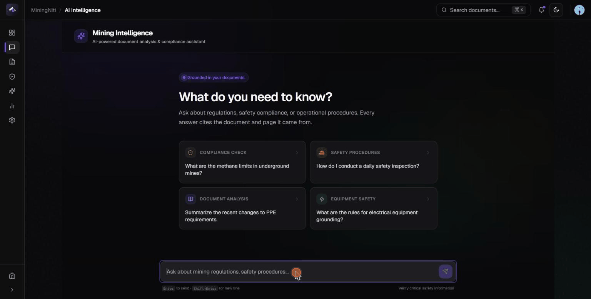
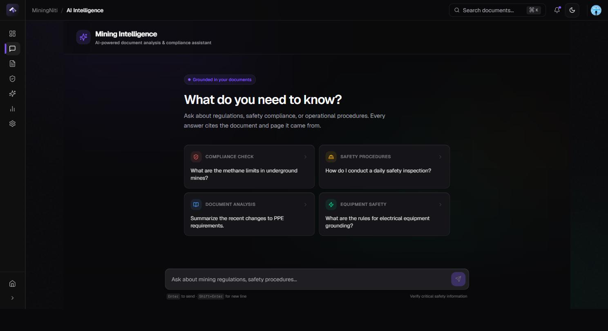
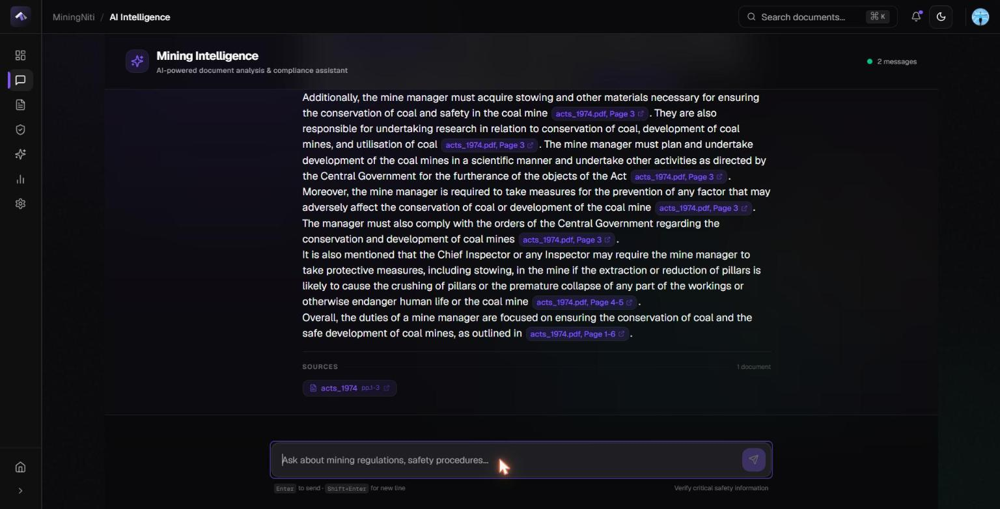
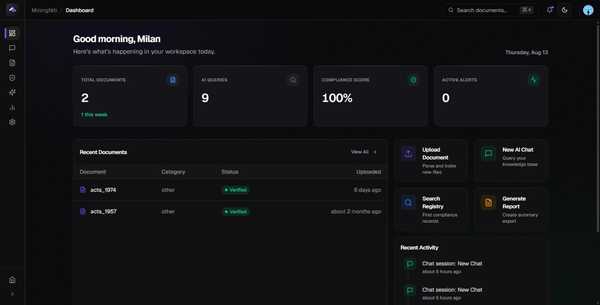
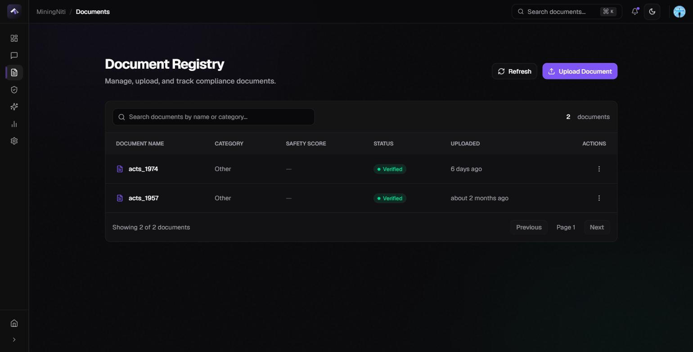

<div align="center">

```
 ███╗   ███╗██╗███╗   ██╗██╗███╗   ██╗ ██████╗     ███╗   ██╗██╗████████╗██╗
 ████╗ ████║██║████╗  ██║██║████╗  ██║██╔════╝     ████╗  ██║██║╚══██╔══╝██║
 ██╔████╔██║██║██╔██╗ ██║██║██╔██╗ ██║██║  ███╗    ██╔██╗ ██║██║   ██║   ██║
 ██║╚██╔╝██║██║██║╚██╗██║██║██║╚██╗██║██║   ██║    ██║╚██╗██║██║   ██║   ██║
 ██║ ╚═╝ ██║██║██║ ╚████║██║██║ ╚████║╚██████╔╝    ██║ ╚████║██║   ██║   ██║
 ╚═╝     ╚═╝╚═╝╚═╝  ╚═══╝╚═╝╚═╝  ╚═══╝ ╚═════╝     ╚═╝  ╚═══╝╚═╝   ╚═╝   ╚═╝
```

### AI-Powered Document Intelligence for the Mining Industry

[](https://python.org)
[](https://fastapi.tiangolo.com)
[](https://nextjs.org)
[](https://react.dev)
[](https://supabase.com)
[](LICENSE)

[Project History](#project-history) · [Architecture](#architecture) · [Quick Start](#quick-start) · [API Reference](#api-endpoints) · [Deploy](#deployment) · [Contributing](#contributing)

---

<table>
  <tr>
    <td align="center" width="520">
      <br/>
      <strong>Ministry of Coal problem statement</strong><br/>
      <sub>Recognized by Coal India Limited &amp; CMPDI<br/>
      See <a href="#project-history">Project history</a> — the 2023 winning entry was a<br/>
      separate team prototype; this repository is an independent rebuild.</sub>
    </td>
  </tr>
</table>

</div>

---

MiningNiti is a full-stack AI platform that transforms how coal mining organizations manage safety documentation, regulatory compliance, and institutional knowledge. It combines a **multi-agent AI pipeline** (4 agents on upload plus an on-demand compliance auditor, across 3 LLM providers) with **production-grade RAG** (hybrid search + cross-encoder reranking) and **real-time compliance auditing** — turning thousands of fragmented PDFs into an instantly queryable, citation-backed source of truth.

---

## Project history

**Two separate builds, four years apart.**

The original entry was built for **Smart India Hackathon 2023** (Nov–Dec 2023) against the
Ministry of Coal problem statement, by a team, and **won at the national level**. CMPDI
officials who judged the finals initiated follow-up discussions about deploying it at scale;
those talks did not proceed. It was never deployed at CMPDI, and there is no ongoing
institutional relationship.

**This repository is not that codebase.** It is an independent, ground-up rebuild started in
**June 2025** and developed solo since — a production system rather than a hackathon
prototype. None of the 2023 code carried over, and that prototype was never under version
control in a repository I can point to.

|  | Origin | This repository |
|---|---|---|
| **When** | Nov–Dec 2023 | June 2025 – present |
| **Who** | Team (SIH 2023) | Sole developer |
| **Status** | Hackathon prototype | Live, deployed, continuously integrated |

### What changed

> **Note:** the *Origin* column is from recollection — that prototype predates this repository
> and its code is not available to verify against. Every claim in the *This repository* column
> is checkable in the code, and linked where it is not obvious.

|  | SIH 2023 prototype | This repository |
|---|---|---|
| **Architecture** | Single-pass RAG chatbot, built on LangChain | 5 specialized agents — 4 running concurrently on upload, plus an on-demand compliance auditor |
| **Orchestration** | LangChain chains | No agent framework — orchestration is hand-written on `asyncio.gather` with per-agent error isolation, quota-aware provider failover and a content-addressed result cache |
| **Retrieval** | FAISS vector search | Hybrid: pgvector cosine + PostgreSQL full-text, fused with Reciprocal Rank Fusion, then cross-encoder reranked (top-20 → top-5) |
| **Models** | Open-source model with DPO, Gemini-backed | 3 LLM providers (Groq, Cerebras, Mistral) with quota-aware automatic failover; Gemini for embeddings |
| **Evaluation** | — | Hit Rate@k / MRR / Recall@k / nDCG@k harness over a labelled golden set, running as a **blocking CI gate**; LangSmith tracing on the orchestrator, retrieval and chat |
| **Security** | — | Clerk JWT (RS256-pinned, JWKS caching, `azp` validation), prompt-injection guardrails, DNS-resolving SSRF guard, 120 req/min rate limiting |
| **Tests** | — | 215 unit tests (274 collected, including integration and eval suites) |
| **Stack** | Python backend, TypeScript frontend | FastAPI + PostgreSQL/pgvector · Next.js 16 / React 19 |
| **Deployment** | Local | Live on free-tier infrastructure, auto-deployed from `main` |

---

## Demo

<div align="center">

### [▶&nbsp; Try it live — miningniti.vercel.app](https://miningniti.vercel.app)

<sub>The backend runs on a free HuggingFace Space, kept warm by a scheduled ping.<br/>
If it has been idle, the first request may take up to a minute while the container wakes.</sub>

</div>

<br/>

### Retrieval-augmented chat, end to end

<div align="center">



</div>

<div align="center">
<sub><i>A regulatory question, start to finish: hybrid search retrieves and reranks,<br/>
the answer streams back token by token, and every claim carries its document and page.</i></sub>
</div>

<br/>

> [!NOTE]
> **About the answer in the recording.** The model states that a *manager's*
> duties are not spelled out in the retrieved context, and offers the *owner's*
> duties instead — with citations. That is the intended behaviour, not a miss:
> the system prompt forbids answering beyond retrieved context, so a near-miss
> is reported as a near-miss rather than confabulated into a confident answer.

<br/>

### The interface

<table>
  <tr>
    <td width="50%" valign="top">
      
      <p align="center"><b>Ask anything</b><br/><sub>Starter questions show exactly what they will ask.</sub></p>
    </td>
    <td width="50%" valign="top">
      
      <p align="center"><b>Cited answers</b><br/><sub>Every claim links to a document and page, opening in the PDF viewer.</sub></p>
    </td>
  </tr>
  <tr>
    <td width="50%" valign="top">
      
      <p align="center"><b>Dashboard</b><br/><sub>Corpus size, query volume, compliance score and live activity.</sub></p>
    </td>
    <td width="50%" valign="top">
      
      <p align="center"><b>Document registry</b><br/><sub>Upload, track processing status and review AI analysis.</sub></p>
    </td>
  </tr>
</table>

---

## Table of Contents

- [Project History](#project-history)
- [Demo](#demo)
- [The Problem](#the-problem)
- [The Solution](#the-solution)
- [Key Features](#key-features)
- [Architecture](#architecture)
- [Tech Stack](#tech-stack)
- [Quick Start](#quick-start)
- [API Endpoints](#api-endpoints)
- [Project Structure](#project-structure)
- [Deployment](#deployment)
- [Testing](#testing)
- [MLOps](#mlops)
- [Security](#security)
- [Performance](#performance)
- [Known Limitations](#known-limitations)
- [Contributing](#contributing)
- [License](#license)

---

## The Problem

Coal mining operations generate **thousands of critical documents** — MSHA regulations, equipment manuals, safety protocols, environmental impact assessments, and incident investigations. Information is scattered across PDFs, scanned forms, and siloed databases. Finding a specific clause across 500 pages of safety protocols takes hours, and missing a regulation update can mean violations, fines, or lives.

## The Solution

MiningNiti deploys **5 specialized AI agents** across 3 LLM providers that understand mining domain context. Four run automatically on every upload; the compliance auditor runs on demand when you create an audit:

| Capability | Agent |
|---|---|
| **Auto-classify** documents into safety, equipment, regulatory, and geological categories | Classifier (Groq / GPT-OSS-120B) |
| **Detect hazards** and flag compliance violations against MSHA/OSHA standards | Safety Analyzer (Mistral / Magistral) |
| **Extract entities** — equipment names, chemicals, regulations, personnel, locations | Entity Extractor (Cerebras / GPT-OSS-120B) |
| **Summarize** long documents with actionable key points | Summarizer (Cerebras / GPT-OSS-120B) |
| **Audit compliance** by cross-referencing operational docs against regulations | Compliance Auditor (Groq / GPT-OSS-120B) |
| **Answer questions** with page-level citations from your document corpus | RAG Chat (Groq / GPT-OSS-120B, over hybrid search + reranking) |

---

## Key Features

### Multi-Agent AI Pipeline

The classifier runs first — its category feeds the others — then three agents run concurrently:

```
Document Upload
       │
       ▼
  ┌─────────────┐
  │ Orchestrator │──── Classifier first, then 3 concurrently
  └──────┬──────┘
         │
         ▼
    Classifier ──── category feeds the three below
     (Groq)
         │
   ┌─────┴──────┬──────────────┐
   ▼            ▼              ▼
 Safety       Entity       Summarizer
Analyzer     Extractor       Agent
(Mistral)   (Cerebras)     (Cerebras)
   │            │              │
   └─────┬──────┴──────────────┘
         ▼
  Chunks + Embeddings → pgvector (HNSW index)

  Compliance Auditor (Groq) runs separately, on demand,
  when you create an audit — not part of this pipeline.
```

Repeat analysis of identical content is served from a Redis cache keyed by
content hash, so re-uploads cost zero LLM calls. Failed analyses are never
cached, so re-analysing after a rate limit genuinely retries.

The pipeline degrades loudly rather than silently. Groq and Cerebras fall
back to one another when a provider returns a quota error, and when a section
still cannot be produced the document completes with the other three intact:
the failure is recorded on `Document.processing_error` and in
`metadata.degraded_sections`, and surfaced in the UI, instead of being
laundered into a plausible-looking empty result.

### Production RAG Pipeline

The retrieval system goes beyond basic vector search with a multi-stage pipeline:

```
Query → Embed → Hybrid Search (Vector + Full-Text) → RRF → Cross-Encoder Rerank → Top-5 → LLM
```

| Stage | What it does |
|---|---|
| **Hybrid Search** | pgvector cosine similarity + PostgreSQL full-text search (`ts_rank_cd` over a GIN-indexed `tsvector`) combined via Reciprocal Rank Fusion. Not BM25 — true BM25 needs an extension such as `pg_search`. |
| **Cross-Encoder Reranking** | `ms-marco-MiniLM-L-6-v2` reranks top-20 candidates for precise relevance scoring |
| **Similarity Threshold** | Filters irrelevant chunks before context formatting |
| **System Role Prompt** | Proper LLM message structure for better instruction following |

- Streaming responses token-by-token via Server-Sent Events (SSE)
- Every answer cites `[Document, Page X]` — no hallucination without source
- Multi-turn session management with full conversation history

### Compliance Auto-Auditor

- Cross-references operational documents against regulatory documents
- Generates per-clause compliance matrices (Pass / Fail / Not Addressed)
- Tracks audit status: Pending → In Progress → Completed
- Frontend dashboard with audit detail views

### Enterprise Dashboard

- Real-time document processing status with background task tracking
- Safety score visualizations and compliance trend analytics
- Category distribution charts powered by Recharts
- KPI grid, activity feed, and recent documents table

### Document Management

- Drag-and-drop upload with PDF, DOCX, TXT support
- Direct file upload to backend (no third-party CDN dependency)
- In-document AI chat — ask questions about a specific document
- PDF viewer modal for inline document review

---

## Architecture

```
┌─────────────────────────────────────────────────────────────────────┐
│                          CLIENT LAYER                                │
│     Next.js 16 · React 19 · Tailwind v4 · shadcn/ui · Vercel      │
│        Clerk Auth · Framer Motion · Recharts · React-PDF            │
└──────────────────────────┬──────────────────────────────────────────┘
                           │ HTTPS
┌──────────────────────────▼──────────────────────────────────────────┐
│                        API GATEWAY                                   │
│    FastAPI 0.128 · Clerk JWT Auth · slowapi Rate Limiter            │
│    Pydantic v2 Validation · CORS · Audit Logging                    │
│    Deployed on: HuggingFace Spaces (Docker)                         │
└──────────────────────────┬──────────────────────────────────────────┘
                           │
         ┌─────────────────┼──────────────────┐
         ▼                 ▼                  ▼
┌──────────────┐  ┌──────────────┐  ┌──────────────┐
│  Documents   │  │  Chat (SSE)  │  │  Compliance  │
│  Upload + AI │  │  RAG Pipeline│  │  Audit APIs  │
└──────┬───────┘  └──────┬───────┘  └──────┬───────┘
       │                 │                  │
       └─────────────────┼──────────────────┘
                         ▼
┌─────────────────────────────────────────────────────────────────────┐
│                     RAG RETRIEVAL PIPELINE                           │
│                                                                     │
│   Query → Embed (Gemini) → Hybrid Search → RRF → Rerank → Top-5   │
│                                                                     │
│   ┌─────────────┐  ┌─────────────┐  ┌────────────────────────┐     │
│   │  pgvector   │  │  full-text  │  │  Cross-Encoder Rerank  │     │
│   │  (semantic) │  │ (keyword)   │  │  (ms-marco-MiniLM)     │     │
│   └──────┬──────┘  └──────┬──────┘  └───────────┬────────────┘     │
│          └────────┬───────┘                      │                  │
│           Reciprocal Rank Fusion                 ▼                  │
│                                    Precise Top-5 Chunks             │
└──────────────────────────┬──────────────────────────────────────────┘
                           ▼
┌─────────────────────────────────────────────────────────────────────┐
│                       AI AGENT LAYER                                 │
│                                                                     │
│  ┌───────────┐ ┌───────────┐ ┌───────────┐ ┌───────────┐           │
│  │Classifier │ │  Safety   │ │  Entity   │ │Summarizer │           │
│  │  (Groq)   │ │ (Mistral) │ │(Cerebras) │ │(Cerebras) │           │
│  └───────────┘ └───────────┘ └───────────┘ └───────────┘           │
│                  ┌───────────┐ ┌───────────┐                        │
│                  │Compliance │ │ Orchestrator│                       │
│                  │  (Groq)   │ │ (parallel) │                       │
│                  └───────────┘ └───────────┘                        │
└──────────────────────────┬──────────────────────────────────────────┘
                           │
         ┌─────────────────┼──────────────────┐
         ▼                 ▼                  ▼
┌───────────────┐  ┌───────────────┐  ┌───────────────┐
│  Supabase     │  │  Upstash      │  │  AI Providers │
│  PostgreSQL   │  │  Redis        │  │               │
│  + pgvector   │  │   (Cache)     │  │ Gemini · Groq │
│  (HNSW index) │  │               │  │ Mistral       │
│  (Free tier)  │  │  (Free tier)  │  │ Cerebras      │
└───────────────┘  └───────────────┘  └───────────────┘
```

---

## Tech Stack

| Layer | Technology | Version |
|---|---|---|
| **Frontend** | Next.js (App Router, Turbopack) · React · TypeScript · Tailwind CSS v4 · shadcn/ui · Clerk Auth · Zustand · TanStack React Query · Recharts | 16.x / 19.x / 5.x |
| **Backend** | FastAPI · Python · SQLAlchemy (synchronous sessions) · Pydantic v2 · slowapi Rate Limiting · sentence-transformers CrossEncoder | 0.128 / 3.11+ / 2.0 |
| **Database** | Supabase PostgreSQL + pgvector + pg_trgm (HNSW index) | 16+ |
| **AI Agents** | Groq (GPT-OSS-120B — document agents *and* RAG chat generation) · Mistral (Magistral) · Cerebras (GPT-OSS-120B) | All free tiers |
| **Embeddings & Eval** | Gemini `gemini-embedding-001` for chunk and query embeddings; `gemini-3.7-flash` as the judge in the on-demand generation eval — it generates no user-facing answers | All free tiers |
| **Infrastructure** | Vercel (frontend) · HuggingFace Spaces (backend, Docker) · Supabase (DB) · Upstash (Redis) · Clerk (Auth) | All free tiers |

> **Total infrastructure cost: $0/month**

---

## Quick Start

### Prerequisites

- **Python 3.11+** and **Node.js 24+** (pinned in `frontend/.nvmrc` and `frontend/package.json`)
- **Docker & Docker Compose** (recommended for local development)
- **Free accounts**: Supabase, Upstash, Clerk, Google AI Studio, Groq, Cerebras, Mistral

### 1. Clone & Configure

```bash
git clone https://github.com/Iammilansoni/MiningNiti.git
cd MiningNiti

cp backend/.env.example backend/.env
cp frontend/.env.example frontend/.env.local
# Edit both with your keys (see Environment Variables below).
# backend/.env.example carries every backend variable, including the
# SUPABASE_URL / SUPABASE_SERVICE_KEY / SUPABASE_STORAGE_BUCKET block —
# copy those across too, or uploaded files are lost on every restart.
```

### 2. Docker (Recommended)

```bash
docker-compose up -d
```

This starts PostgreSQL (with pgvector), Redis, backend, and frontend.

### 3. Manual Setup

**Backend:**
```bash
cd backend
python -m venv venv
source venv/bin/activate        # Windows: venv\Scripts\activate
pip install -r requirements.txt
uvicorn app.main:app --reload --port 8000
```

**Frontend:**
```bash
cd frontend
npm install
npm run dev                     # http://localhost:3000
```

### Environment Variables

| Variable | Required | Description |
|---|---|---|
| `DATABASE_URL` | Yes | Supabase PostgreSQL connection string (use Transaction pooler, port 6543) |
| `GEMINI_API_KEY` | Yes | Google Gemini API key from [aistudio.google.com](https://aistudio.google.com/apikey) |
| `GROQ_API_KEY` | Yes | Groq API key from [console.groq.com](https://console.groq.com) |
| `MISTRAL_API_KEY` | Yes | Mistral API key from [console.mistral.ai](https://console.mistral.ai) |
| `CEREBRAS_API_KEY` | Yes | Cerebras API key from [cloud.cerebras.ai](https://cloud.cerebras.ai) |
| `CLERK_JWKS_URL` | Yes | Clerk JWKS endpoint, used by the **backend** to verify session tokens |
| `CLERK_AUTHORIZED_PARTIES` | Recommended | Backend. Allowed `azp` origins. Empty means any app on your Clerk instance is accepted |
| `REDIS_URL` | No | Upstash Redis URL. Use the `rediss://` scheme for TLS — **not** `?tls=true`, which redis-py rejects with `unexpected keyword argument 'tls'`. |
| `NEXT_PUBLIC_API_BASE_URL` | Yes | Backend URL for frontend (e.g. `https://your-space.hf.space`) |
| `NEXT_PUBLIC_CLERK_PUBLISHABLE_KEY` | Yes | Clerk publishable key for frontend auth |
| `CLERK_SECRET_KEY` | Yes | Clerk secret key — **frontend only** (Next.js server side). The backend never reads it |
| `SUPABASE_URL` | Recommended | Supabase project URL. Enables durable upload storage — **without it, uploaded files are lost on every restart** |
| `SUPABASE_SERVICE_KEY` | Recommended | Supabase service role key (the uploads bucket is private) |
| `SUPABASE_STORAGE_BUCKET` | No | Bucket name, defaults to `documents` |

---

## API Endpoints

All endpoints are prefixed with `/api/v1`.

### Health

| Method | Endpoint | Description |
|---|---|---|
| GET | `/` | Application info |
| GET | `/health` | Cheap static liveness probe (no `/api/v1` prefix) — what the Docker `HEALTHCHECK` uses |
| GET | `/api/v1/health` | Real health check: database, Redis, and a 1-token ping to each LLM provider. `healthy` and `degraded` both return 200; an unreachable database returns 503 |
| GET | `/api/v1/health/providers` | Per-provider liveness detail. Add `?fresh=true` to bypass the 60s cache |

### Documents

| Method | Endpoint | Description |
|---|---|---|
| GET | `/api/v1/documents` | List documents (paginated) |
| POST | `/api/v1/documents` | Create document from URL |
| POST | `/api/v1/upload` | Upload file directly (multipart) |
| GET | `/api/v1/documents/{id}` | Get document detail |
| DELETE | `/api/v1/documents/{id}` | Delete document |
| GET | `/api/v1/documents/{id}/file` | Stream the stored file (local disk or Supabase Storage) |
| GET | `/api/v1/documents/{id}/analysis` | Get AI analysis results |
| POST | `/api/v1/documents/{id}/reanalyze` | Trigger re-analysis |

### Chat (Streaming)

| Method | Endpoint | Description |
|---|---|---|
| GET | `/api/v1/chat/sessions` | List chat sessions |
| POST | `/api/v1/chat/sessions` | Create new session |
| GET | `/api/v1/chat/sessions/{id}` | Get session with messages |
| PATCH | `/api/v1/chat/sessions/{id}` | Update session |
| DELETE | `/api/v1/chat/sessions/{id}` | Delete session |
| POST | `/api/v1/chat/send` | Send message (synchronous RAG) |
| POST | `/api/v1/chat/stream` | Stream response (SSE) |

### Compliance Audit

| Method | Endpoint | Description |
|---|---|---|
| GET | `/api/v1/compliance/audits` | List audits |
| POST | `/api/v1/compliance/audits` | Create compliance audit |
| GET | `/api/v1/compliance/audits/{id}` | Get audit detail + matrix |
| GET | `/api/v1/compliance/audits/{id}/export` | Export the audit report |
| DELETE | `/api/v1/compliance/audits/{id}` | Delete an audit |

### Search, Analytics & More

| Method | Endpoint | Description |
|---|---|---|
| GET | `/api/v1/search?q={query}` | Semantic vector search |
| GET | `/api/v1/analytics/dashboard` | Dashboard statistics |
| GET | `/api/v1/analytics/documents` | Document analytics |
| GET | `/api/v1/analytics/safety` | Safety compliance analytics |
| GET | `/api/v1/analytics/violations` | Detected compliance violations |
| GET | `/api/v1/prompts` | List saved prompt templates |
| POST | `/api/v1/prompts` | Save prompt template |
| GET | `/api/v1/prompts/{id}` | Get a prompt template |
| PUT | `/api/v1/prompts/{id}` | Update a prompt template |
| DELETE | `/api/v1/prompts/{id}` | Delete a prompt template |
| GET | `/api/v1/jobs` | List active background jobs |
| GET | `/api/v1/jobs/{id}` | Get job status |
| GET | `/api/v1/user/profile` | Get user profile |
| PUT | `/api/v1/user/profile` | Update user profile |

---

## Project Structure

```
MiningNiti/
├── backend/
│   ├── app/
│   │   ├── api/v1/          # API endpoints (documents, chat, compliance, analytics, search)
│   │   ├── agents/          # 5 agents + orchestrator (4 on upload, compliance on demand)
│   │   ├── models/          # SQLAlchemy models (documents, chat, compliance, audit)
│   │   ├── schemas/         # Pydantic request/response schemas
│   │   ├── services/        # Business logic (RAG, hybrid search, reranker, compliance)
│   │   ├── core/            # Security, exceptions, config
│   │   └── db/              # SQLAlchemy engine + pgvector init
│   ├── tests/unit/          # 203 unit tests (SQLite, every provider mocked)
│   ├── tests/integration/   # 27 API tests against a real PostgreSQL
│   ├── tests/eval/          # 32 retrieval + generation evaluation tests
│   └── Dockerfile           # Docker build for HuggingFace Spaces
├── frontend/
│   ├── src/
│   │   ├── app/             # Next.js App Router (auth, dashboard, chat, documents, compliance, analytics)
│   │   ├── components/      # Landing (15 components), chat, documents, dashboard, analytics, prompts, product, layout, settings, ui
│   │   ├── hooks/           # SSE streaming, typed API client
│   │   └── lib/             # API client with auth headers
│   └── package.json
├── docker-compose.yml
├── docker-compose.prod.yml
└── ARCHITECTURE.md
```

---

## Deployment

The entire application runs on **free-tier services** with zero infrastructure cost.

```
┌──────────────┐     ┌──────────────────┐     ┌──────────────┐
│   Frontend   │────▶│     Backend      │────▶│   Database   │
│   Vercel     │     │ HuggingFace      │     │  Supabase    │
│              │     │ Spaces (Docker)  │     │  + pgvector  │
└──────────────┘     └──────────────────┘     └──────────────┘
                              │
                              ▼
                       ┌──────────────┐
                       │    Redis     │
                       │   Upstash    │
                       └──────────────┘
```

### Setup Steps

1. **Database** (Supabase): Create project, copy Transaction pooler connection string (port 6543), run `CREATE EXTENSION IF NOT EXISTS vector; CREATE EXTENSION IF NOT EXISTS pg_trgm;`
2. **Redis** (Upstash, optional): Create Redis database, copy the `rediss://` URL (TLS is implied by the scheme; do not append `?tls=true`)
3. **Auth** (Clerk): Create app, copy Publishable Key, Secret Key, and JWKS URL
4. **AI Keys** (all free): [Gemini](https://aistudio.google.com/apikey), [Groq](https://console.groq.com), [Cerebras](https://cloud.cerebras.ai), [Mistral](https://console.mistral.ai)
5. **Backend** (HuggingFace Spaces): Create Docker space, clone, copy `backend/` files, push, add env vars in Settings
6. **Frontend** (Vercel): Import repo, add `NEXT_PUBLIC_API_BASE_URL` (HF space URL) + Clerk keys, deploy

### Environment Variables

| Variable | Required | Description |
|---|---|---|
| `DATABASE_URL` | Yes | Supabase PostgreSQL (Transaction pooler, port 6543) |
| `GEMINI_API_KEY` | Yes | Google Gemini API key |
| `GROQ_API_KEY` | Yes | Groq API key |
| `MISTRAL_API_KEY` | Yes | Mistral API key |
| `CEREBRAS_API_KEY` | Yes | Cerebras API key |
| `CLERK_JWKS_URL` | Yes | Clerk JWKS endpoint (backend) |
| `CLERK_AUTHORIZED_PARTIES` | Recommended | Allowed `azp` origins (backend) |
| `REDIS_URL` | No | Upstash Redis URL. Use the `rediss://` scheme for TLS — **not** `?tls=true`, which redis-py rejects with `unexpected keyword argument 'tls'`. |
| `NEXT_PUBLIC_API_BASE_URL` | Yes | Backend URL for frontend |
| `NEXT_PUBLIC_CLERK_PUBLISHABLE_KEY` | Yes | Clerk publishable key |
| `CLERK_SECRET_KEY` | Yes | Clerk secret key (frontend only) |
| `SUPABASE_URL` | Recommended | Supabase project URL. Enables durable upload storage — **without it, uploaded files are lost on every restart** |
| `SUPABASE_SERVICE_KEY` | Recommended | Supabase service role key (the uploads bucket is private) |
| `SUPABASE_STORAGE_BUCKET` | No | Bucket name, defaults to `documents` |

---

## Testing

```bash
cd backend
docker compose up -d postgres                            # integration + retrieval tests need it

pytest tests/unit/ -v -m unit                           # 203 unit tests (SQLite, providers mocked)
pytest tests/integration/ -v -m integration              # 27 tests against real PostgreSQL
pytest tests/eval/test_rag_eval.py -v -m synthetic       # Generation eval (no DB, instant)
pytest tests/eval/test_rag_eval.py -v -m live            # Generation eval (needs Gemini quota)
pytest tests/unit/ --cov=app --cov-report=html           # With coverage
```

**274 tests collected** — 215 unit, 27 integration, 32 eval. The unit tests cover all 5 AI agents (every provider mocked, so no test marked `unit` makes a live call), RAG chat service, hybrid search + reranking, text chunking, document extractors, and settings validation.

Not all 262 run in every environment, and that is deliberate:

- The **integration** suite runs against a real PostgreSQL — the `pgvector/pgvector:pg16` service container CI starts, or `docker compose up -d postgres` locally. SQLite could not bind the PostgreSQL `UUID` columns, enforce the foreign keys, or run `to_tsvector` at all. With no server reachable, the package skips with an explanatory message rather than failing.
- The **6 live tests** in `tests/eval/test_rag_eval.py` are Gemini-judged and need real API quota, so they are not run in CI. The other 2 tests in that file are synthetic and run anywhere.

**CI gates.** Unit tests, integration tests, the retrieval-quality gate, the frontend `npm run lint` and the Docker build are all **blocking**. `mypy`, `bandit` and `npm audit` stay non-blocking, each with the concrete reason written beside it in `.github/workflows/ci.yml`.

**Linting:** `isort` + `black` (backend), `npm run lint` (frontend).

---

## MLOps

### Guardrails

Input validation protecting the RAG pipeline from prompt injection and abuse. 20+ regex patterns cover instruction override, system prompt extraction, jailbreak, and role-play attacks. Queries exceeding 1500 characters or containing injection patterns are rejected (422/403).

### Observability

LangSmith tracing for end-to-end AI pipeline visibility — traces `AgentOrchestrator.analyze_document()`, `hybrid_search()`, and `ChatService.generate_response()` (sync + streaming). Falls back to no-op when langsmith is not installed.

### RAG Evaluation

RAG fails in two distinct ways and they are measured separately, because a
blended score hides which one happened:

**Retrieval quality** — was the right chunk ever in the context?
Scored against a labelled golden set of 12 queries over a 130-chunk mining
corpus. Runs in CI as a **blocking gate**, using a local sentence-transformers
model so it needs no API keys and is deterministic.

| Metric | What it measures | Floor | Current |
|---|---|---|---|
| Hit Rate@5 | Any relevant chunk in the top 5 | 0.90 | 1.000 |
| MRR | How high the first relevant chunk lands | 0.75 | 1.000 |
| Recall@5 | Share of relevant chunks retrieved | 0.85 | 0.958 |
| nDCG@5 | Rewards clustering relevant chunks high | 0.75 | 0.968 |

**Generation quality** — given good context, was the answer faithful?
Gemini-judged, run on demand rather than in CI (needs an API key).

| Metric | What it measures | Threshold |
|---|---|---|
| Faithfulness | Are all claims grounded in retrieved context? | 0.70 |
| Relevancy | Does the answer actually address the question? | 0.70 |

```bash
pytest tests/eval/test_retrieval_eval.py -v -m retrieval   # Retrieval gate (needs Postgres)
pytest tests/eval/test_rag_eval.py -v -m synthetic         # Generation, no DB
pytest tests/eval/test_rag_eval.py -v -m live              # Generation, full pipeline
```

> **A finding worth stating.** Stubbing the lexical arm to return nothing leaves
> every aggregate metric unchanged — the cross-encoder reranker fully
> compensates on a corpus this size. Aggregate scores therefore cannot prove an
> arm is alive, which is why the suite also carries direct guards asserting the
> lexical index returns rows and can distinguish near-identical citations
> (`30 CFR 75.323` vs `75.400`). Those are the tests that actually fail when it
> breaks.

---

## Security

Clerk JWT auth (JWKS) with user-scoped resource access. Rate limiting (120 req/min per IP), Pydantic v2 validation on all inputs, prompt injection guardrails, SQLAlchemy parameterized queries, audit logging on all mutations, configurable CORS, and secrets stored as environment variables (never committed).

---

## Performance

Hybrid search (pgvector + PostgreSQL full-text) with Reciprocal Rank Fusion, cross-encoder reranking (`ms-marco-MiniLM-L-6-v2`), HNSW approximate nearest-neighbour search, 3 agents running concurrently via `asyncio.gather()` after classification, an analysis cache that skips repeat work entirely, batched embedding (100 chunks per API call), SSE streaming, and crash recovery that resets *and requeues* interrupted documents.

---

## Known limitations

Stated plainly, because a system's real shape is in what it does *not* do yet.

**Architecture**
- Database access is **synchronous SQLAlchemy inside `async` endpoints**, so every query blocks the event loop and per-worker throughput is bounded. An async layer exists in `app/db/session.py` but no endpoint uses it yet — cutting over is the next significant piece of work.
- The background queue is an in-process **`asyncio.Queue`**: no persistence, no retries, no backpressure. Queued work does not survive a restart, and it does not fan out across replicas — with two Gunicorn workers, work enqueued in one is invisible to the other. Redis is already a dependency and is the obvious promotion path.
- Agents see the document **head and tail (~15K characters)**, not the full text. Long documents are summarized from their edges.

**Retrieval**
- The lexical arm is PostgreSQL full-text ranking (`ts_rank_cd` over a GIN-indexed `tsvector`) — **not BM25**. True BM25 needs an extension such as `pg_search`. The naming here is deliberate.
- The retrieval evaluation runs against a **130-chunk golden corpus**. Metrics at that scale are directional, not a claim about production-scale behaviour.

**Operations**
- Deployed entirely on **free tiers**. The API sleeps when idle; the first request after a quiet period can take up to a minute. Provider quota exhaustion degrades individual agents (surfaced via `/api/v1/health` and the document's `processing_error`) rather than failing the pipeline.
- **No frontend test suite.** The 215 unit tests are all backend.
- `mypy` and `bandit` run in CI but are **non-blocking** — `mypy` currently crashes on a Torch internal, and `bandit`'s 3 medium findings are reviewed false positives. Unit tests, integration tests, formatting, the retrieval gate, and the frontend build/lint *are* blocking.

**Product**
- No packaged connectors — no SharePoint, S3, SAP, Oracle, or Microsoft 365 integration, and no webhooks. Upload is direct; everything else goes through the REST API.
- No air-gapped or on-premise model deployment. The stack self-hosts, but model calls still leave your network.
- Supported uploads are **PDF, DOCX and TXT** up to 50MB. Spreadsheets, images and email archives are not handled.

---

## Contributing

1. Fork the repository
2. Create a feature branch: `git checkout -b feat/amazing-feature`
3. Make changes following code style: `isort` + `black` (backend), `npm run lint` (frontend)
4. Add tests, ensure unit tests pass: `pytest tests/unit/ -v -m unit`
5. Commit: `feat(backend): add amazing feature`
6. Push and open a Pull Request

---

## License

MIT License — see [LICENSE](LICENSE) for details.

---

<div align="center">

**Built for the Mining Industry** · **Powered by 4 AI Providers** · **$0/month Infrastructure**

<br/>

[](https://twitter.com/Iammilansoni)
[](https://github.com/Iammilansoni)

Smart India Hackathon 2023 — National Winner · Ministry of Coal · Recognized by Coal India Limited & CMPDI

<sub>The 2023 winning entry was a separate team prototype. See <a href="#project-history">Project history</a>.</sub>

</div>
